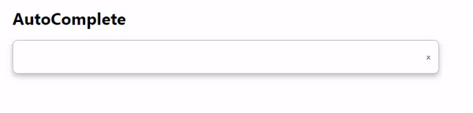

# wanted_pre_onboarding

<br>

## Toggle.js


**조건 파악**

1. 토글 on/off에 따라 글자와 색깔 변화
2. 색 채워지는 애니메이션 효과

- 구현 방법

  토글 여부에 따라 색깔과 버튼의 위치를 조정해야하므로 `isToggled` 라는 상태를 두어 상태에 따라 class가 적용되도록 해 색깔과 버튼의 위치를 변경하였습니다.  `handleToggleClick` 함수를 통해 간접적으로 상태에 접근하도록 했습니다.

- 구현하면서 어려웠던 점과 해결방법

  버튼 배경과 동그란 버튼 부분을 한 div 안에서 구현하고 싶어 동그란 버튼은 ::after를 이용해 구현하였습니다. 그렇게 하니 배경색깔만 변경되거나 혹은 버튼배경의 위치까지 함께 변경되는 문제가 생겼습니다.

  그래서 div를 분리하여 `ToggleBtn`을 배경으로 `Circle`을 동그란 버튼으로 스타일을 적용하여 해결하였습니다.

- 자세한 실행 방법

  `ToggleBtn`을 버튼의 배경으로 만들고 `Circle` 동그란 버튼으로 만들어 처리했습니다. `handleToggleClick`함수를 통해 toggle의 true/false 값을 변경하였습니다. 토글 on/off에 따라 스타일이 바뀌어야 하므로, 삼항 연산자를 이용해 className을 추가했습니다.

  ```react
  <>
      <ToggleBtn
          className={`toggle-btn ${isToggled ? "background-change" : ""}`}
          onClick={handleToggleClick}
          >
          <Circle className={`${isToggled ? "moved" : ""}`}></Circle>
      </ToggleBtn>
      <p>{isToggled ? "Toggle Switch ON" : "Toggle Switch OFF"}</p>
  </>
  ```

  <br>

  <br>

  

## Modal.js

****

**조건 파악**

1. 모달 클릭시 회색배경과 창 열림
2. X표 클릭시 창꺼짐

- 구현한 방법과 이유에 대한 간략한 내용

  모달이 열려야 하는지, 닫혀야 하는지 여부를 알아야 하므로 `isModalOn` 라는 상태를 두었고, true인 경우 모달이 나타나도록 하였습니다. ` handleModalClick`함수를 통해 모달 상태 변경하였습니다.

- 구현하면서 어려웠던 점과 해결 방법 (Error Handling Log)

  버튼 클릭시 회색 배경과 모달창을 동시에 띄워야 하는데, 이때 뒷배경이 모달창을 가리지 않도록 구현해야 했습니다.

  각각의 div를 만들어 동일한 depth에 위치시키니 서로 겹쳐 뒷배경이 모달창을 가리는 현상이 일어났습니다. 그래서 뒷배경 div 안에 모달창 div를 중첩하는 구성으로 마크업을 수정하여 해결하였습니다.

- 자세한 실행 방법

  마크업 구성은 아래 나와있는 코드를 통해 확인할 수 있습니다.

  `ModalBtn`을 클릭하면 `handleModalClick` 함수가 `isModalOn`의 상태를 바꿔 모달창과 뒷배경이 나타나게 됩니다. 

   X표시를 클릭할 경우 모달창이 없어져야 하므로 마찬가지로 `handleModalClick`함수를 사용해 `isModalOn`상태를 바꾸도록 했습니다.

  ```react
  <>
      <ModalBtn onClick={handleModalClick}>Open Modal</ModalBtn>
      {isModalOn && (
          <>
          <ModalBackground>
              <ModalLayout>
                  <span onClick={handleModalClick} className="close-btn">
                      X
                  </span>
                  <p className="content">HELLO CODESTATES!</p>
              </ModalLayout>
          </ModalBackground>
          </>
      )}
  </>
  ```

  <br>

  <br>

  

## Tab.js

****

**조건 파악**

1. Tab클릭 시 색깔 및 글자 변경
2. 탭 맨 앞에 회색 공간 존재

- 구현한 방법과 이유에 대한 간략한 내용

  선택된 tab인 경우 스타일을 다르게 적용해야 하므로 `selectedTab`에 활성화된 tab id를 저장하였으며`handleTabClick`함수를 통해 클릭에 따라 tab id 변경하였습니다. 

  `selectedTab`과 각 tab의 idx를 비교하여 같을 경우는 해당 tab이 선택된 것이므로 className에 active를 추가하여 스타일을 변경하도록 하였습니다.

  추가적으로  `selectedTab`에 따라 "ONE","TWO", "THREE"로 글자가 바뀌어야 하는 부분은 Tab 컴포넌트 바깥에 객체를 선언해서 해당 key값에 따라  맞는 value 값을 출력했습니다.

- 구현하면서 어려웠던 점과 해결 방법 (Error Handling Log)

  특별히 구현함에 있어 어려운 점은 없었으나, 각각의 tab을 식별할 수 있어야 하므로 idx를 이용하여 tab을 구분하였습니다. 

- 자세한 실행 방법

  map함수를 이용해 3개의 `TabItem`을 그렸으며 idx가 tab id로 사용되게 하였습니다. 각각의 tab을 누르면 색깔이 변하여 어느 tab이 클릭된 상태인지 알 수 있습니다. 

  초기에 아무것도 클릭되어 있지 않았을 때는 가장 첫번째 tab이 클릭된 상태로 설정해 놓았습니다. text로 나타냈을 때는 1부터 시작해야 하므로 idx + 1 로 표기했습니다.

  ```react
  <>
      <TabContainer>
          {[0, 1, 2].map((idx) => (
              <TabItem
                  key={idx}
                  onClick={() => handleTabClick(idx)}
                  className={selectedTab === idx ? "active" : ""}
                  >
                  Tab{idx + 1}
              </TabItem>
          ))}
      </TabContainer>
      <p>Tab menu {numToStr[selectedTab]}</p>
  </>
  ```

<br>

<br>

## Tag.js


**조건 파악**

1. 원하는 단어 작성하고 엔터할 경우 태그 생성
2. x 표시 클릭시 태그 삭제

- 구현한 방법과 이유에 대한 간략한 내용

  `hashtag`와 `hashtagList`를 통해 상태를 관리 input 값이 변할 때 마다 `hashtag` 값을 저장하도록 구현하였습니다. enter 키를 클릭하면 `hashtagList`에 저장된 `hashtag`값을 추가하고 초기화 시켰습니다. 

  추가적으로 중복 태그 발생 시 입력되지 못하도록 처리하였습니다. 

- 구현하면서 어려웠던 점과 해결 방법 (Error Handling Log)

  초기 접근시 `InputBox`를 메인 박스로 만들다보니 `TagItem` 값들이 `InputBox`에 들어가지 않았습니다. 그래서 `TagBox`라는 큰 박스를 하나 만들어 그안에 `TagItem`과 `InputBox`를 위치하도록 마크업하여 해결하였습니다.

- 자세한 실행 방법

  저장된 `hashtagList`를 map 함수를 이용해 각각의 `TagItem`을 만들도록 했으며, x 표시 클릭시 `removeHashtag` 함수를 통해 idx와 일치하는 해시태그가 `hashtagList`에서 삭제됩니다.

   `onKeyUp`을 이용해서 EnterKey가 입력되었을 때는`addHashTag` 함수를 통해 새로운 해시태그가 추가되고, 기존 저장된 값은 초기화됩니다.  `isDuplacte` 함수를 통해 새로운 해시태그가 이전에 입력된 해시태그인지 확인하고, 중복되는 경우 추가되지 않고 중복된 값임을 알려주는 알람이 뜹니다.

  ```react
  <>	
      <TagBox>
          {hashtagList.map((hashtag, idx) => (
              <TagItem key={idx}>
                  <span>{hashtag}</span>
                  <button className="delete-btn" onClick={() => removeHashtag(idx)}>
                      x
                  </button>
              </TagItem>
          ))}
          <InputBox
              type="text"
              value={hashtag}
              onChange={onChangeHashtag}
              placeholder="Press Enter to add tags"
              onKeyUp={onEnterKeyUp}
              />
      </TagBox>
  </>
  ```

  

<br><br>

## AutoComplete.js



**조건 파악**

1. 검색 시마다 드랍다운된 데이터 변화
2. 데이터 클릭시 해당 데이터 입력됨

- 구현한 방법과 이유에 대한 간략한 내용

   `onChangeInputVal`함수를 통해 input의 입력 값을 변경해주었습니다.  그리고  `inputVal`의 값(즉, 입력 값이 존재하면)이 있으면 `data`에서 `inputVal` 문자열이 속한 값들을 나열하도록 하였습니다. 주어진 예시와 같이 입력 값의 대소문자와 관계없이 보여주도록 구현하였습니다.

  추가적으로 x를 누를 경우 입력된 `inputVal`의 값을 초기화 시켰으며, 검색 데이터를 클릭할 경우 `inputVal`의 값을 클릭한 데이터로 변경하도록 구현하였습니다.

- 구현하면서 어려웠던 점과 해결 방법 (Error Handling Log)

  여러가지 케이스을 고려하며 코드를 작성야하는 게 어려웠습니다. 그래서 케이스를 3가지로 나누어 구현하였습니다.

  아래의 3가지 Case가 존재했고, 각 Case에 따라 보여주는 값을 다르게 설정했습니다.

  1) 검색어가 없는 경우  - 드롭다운이 보이지 않도록 처리

  2) 검색어가 있고, 검색결과도 있는 경우 - 드롭다운과 조건에 맞는 검색결과 보여주기

  3) 검색어가 있지만 검색결과가 없는 경우 - 드롭다운이 보이되, 검색결과가 없다는 메세지 보여주기

- 자세한 실행 방법

   `useEffect ` 를 이용해  `inputVal`에 값이 바뀌게 되면 `onSearch` 함수를 통해  `searchedList`의 새로운 검색결과 데이터를 저장하도록 하였습니다. 만약 1) `inputVal`이 없을 경우 `searchedList` 값을 초기화 시켜주었습니다.

  ```react
  useEffect(() => {
      if (inputVal) {
        onSearch();
      } else {
        setSerchedList([]);
      }
    }, [inputVal]);
  ```

  `inputVal` 이 존재하는 경우만 `Dropdown`이 보이도록 하였습니다. 그리고 2)  `searchedList.length `가 0보다 큰 경우는 검색결과 데이터가 있으므로 map 함수를 이용하여 `SearchedItem`을 보여주도록 하였고, 3) 아닌 경우에는 "검색결과가 없습니다" 를 화면에 출력하도록 하였습니다.

  ``` react
  <>
        <InputContainer>
          <InputBox value={inputVal} onChange={onChangeInputVal} />
          <button className="delete-btn" onClick={resetInpuVal}>
            x
          </button>
        </InputContainer>
        {inputVal && (
          <Dropdown>
            {searchedList.length ? (
              searchedList.map((keyword, idx) => (
                <SearchedItem key={idx} onClick={() => onValueUpdate(keyword)}>
                  {keyword}
                </SearchedItem>
              ))
            ) : (
              <div>검색결과가 없습니다.</div>
            )}
          </Dropdown>
        )}
  </>
  ```

<br><br>


## ClickToEdit.js


**조건 파악**

1. 이름과 나이 데이터 입력 가능
2. 입력 값 변경하고 입력창 빠져나오면 출력값 변경

- 구현한 방법과 이유에 대한 간략한 내용

  `input` 값을 입력한 뒤 `onBlurName`/`onBlurAge` 함수를 이용해 focus가 사라지면 값을 업데이트 하도록 구현하였습니다. 사용자 편의를 위해 Enter 키를 클릭해도 focus가 사라지도록 구현하였습니다.

  추가적으로 이름에는 문자만 입력할 수 있도록, 나이에는 숫자만 입력할 수 있도록 처리하였습니다.

- 구현하면서 어려웠던 점과 해결 방법 (Error Handling Log)

  주어진 예시에서는 입력값이 입력되는 즉시 바뀌지 않고, 입력창에서 focus가 아웃되면 입력값이 업데이트 되도록 구현되었습니다. 그래서 `onBlur`를 사용하여 처리하였고, enter 키도 마찬가지로 enter 키 입력시 `e.target.blur()`를 실행시켜 처리하였습니다. 

- 자세한 실행 방법

  `onBlur`를 이용하여 입력창에 focus가 아웃 되었을때 `onBlurName`/`onBlurAge` 함수를 이용해 값을 업데이트하였습니다.

  ```react
  <>
      <InputContainer>
          <Label htmlFor="name">이름</Label>
          <Input id="name" onBlur={onBlurName} onKeyUp={onEnterKeyUp} />
      </InputContainer>
      <InputContainer>
          <Label htmlFor="age">나이</Label>
          <Input id="age" onBlur={onBlurAge} onKeyUp={onEnterKeyUp} />
      </InputContainer>
      <Content>
          <span>이름 {name}</span>
          <span>나이 {age}</span>
      </Content>
  </>
  ```

  <br><br>

  